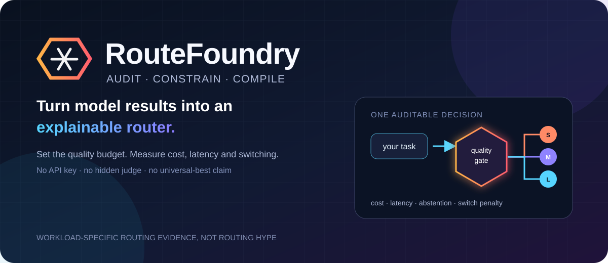
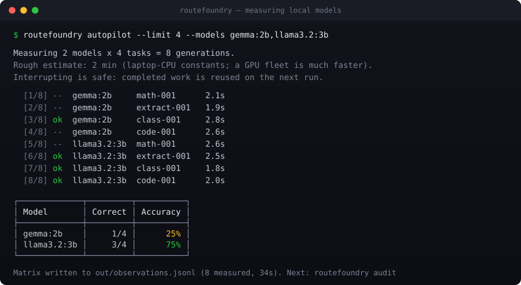
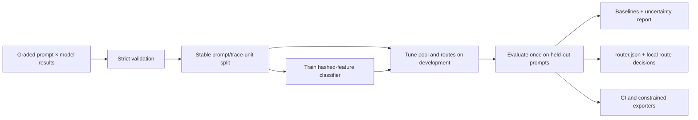

# RouteFoundry

<p align="center">
  
</p>

<p align="center">
  <a href="https://github.com/RitikPatill/routefoundry/actions/workflows/ci.yml"></a>
  
  <a href="LICENSE"></a>
  
</p>

**Find out which of your local models is actually good at what — measured on your hardware,
in one command.** RouteFoundry runs an auto-gradable suite against the models you already
have in Ollama, grades every answer deterministically, and reports accuracy per task type.
No API key, no dataset to assemble, no LLM judge.

On one Windows laptop, across 152 measured generations, **no model won every category**:

| task type | deepseek-r1:1.5b (1.1 GB) | llama3.2:3b (2.0 GB) |
|---|---:|---:|
| arithmetic word problems | **10/12** | 2/12 |
| structured extraction | 4/9 | **9/9** |
| code output prediction | **5/6** | 3/6 |
| median latency | 14.6 s | 1.6 s |

The 1.1 GB reasoning model is five times better at arithmetic than the 2 GB general model,
less than half as good at extraction, and nine times slower. Size did not predict accuracy:
the smallest model scored highest overall, the largest came third. Raw rows, conditions and
limits: [benchmarks/laptop-4model-suite-v1](benchmarks/laptop-4model-suite-v1/).

Your fleet is not this fleet, which is the point — run it and find out.

<p align="center">
  
</p>

```bash
routefoundry autopilot --limit 12      # measure your installed models (minutes, not seconds)
```

RouteFoundry then goes one step further: it can audit that matrix against simple baselines
and compile an explainable routing policy under an explicit quality-loss budget. It is an
**auditor and policy compiler**, not an inference gateway — take the resulting `router.json`
to the runtime you already operate. The core is local: no model call from the audit path,
no API key, no telemetry.

> **On the routing numbers specifically:** per-model accuracy above is reproducible. The
> compiled router's *speed advantage* is not yet, and this project will not print one until
> it is — see [docs/PRE_LAUNCH_FINDINGS.md](docs/PRE_LAUNCH_FINDINGS.md), where the failure
> modes of our own headline are written down.

## See the workflow instantly, without measuring anything

```bash
uv sync
uv run routefoundry demo --output out/demo
```

Open `out/demo/report.html`. The command also writes `summary.json`, `router.json`, a
human-readable policy, a Hugging Face Chat UI default route, and the source JSONL fixture.
It needs no account, key, GPU, model download, or inference server.

> **The demo is synthetic, illustrative, and non-evidence.** Its hand-designed values
> exercise the workflow; they are not measurements of real models and support no quality,
> latency, cost, or savings claim.

After the package is released to PyPI, the equivalent isolated command is
`uvx routefoundry demo --output out/demo`.

## The missing step between evaluation and serving

Routers and gateways already exist. RouteFoundry focuses on the uncomfortable questions
that come first: Which models actually help on *this* workload? Does a cheaper route remain
inside the chosen empirical quality-loss budget? Does that finding survive a held-out
check? What happens when the classifier abstains or a local model is already resident?



The audit reports always-strongest, always-cheapest, always-fastest, deterministic-random,
task-only, warm-only, compiled, and hindsight-oracle baselines. The oracle is explicitly
non-deployable. With complete, gap-free trace ordering, latency can include supplied model
load penalties and reports can count model switches. Without complete trace metadata,
RouteFoundry marks residency metrics unavailable and applies no load or switch penalty.

## Measure your own models

`autopilot` discovers what you already have installed (it never pulls or deletes a model),
runs the bundled 38-task suite against each, and writes the matrix the rest of the tool
consumes:

```bash
routefoundry autopilot                       # every installed model, full suite
routefoundry autopilot --limit 12            # a balanced subset, ~4x faster
routefoundry autopilot --models llama3.2:3b,gemma:2b
```

It prints a duration estimate before starting, reports progress per generation, and is
resumable: interrupt it and the next run reuses completed work. A second run refuses to
share an output with a live one, because concurrent runs inflate each other's latencies.

Every task is graded deterministically — exact number, exact string, JSON field, required
substrings, or regex. Reasoning scratchpads (`<think>` blocks) and answer preambles are
stripped before grading, so a reasoning model is scored on its answer rather than penalised
for its format. That constraint is also the suite's boundary: it measures **verifiable
short-answer ability**, not open-ended generation quality.

## Bring graded observations

Input is UTF-8 JSON Lines: one observation for every prompt/model pair. This is an excerpt
from a complete matrix:

```json
{"prompt_id":"ticket-001","prompt":"Summarize this ticket.","task":"summarization","trace_id":"support-session-07","sequence_index":0,"model":"local-small","quality":0.91,"latency_ms":180.0,"cost_usd":0.0,"load_ms":95.0}
{"prompt_id":"ticket-001","prompt":"Summarize this ticket.","task":"summarization","trace_id":"support-session-07","sequence_index":0,"model":"strong-reference","quality":0.96,"latency_ms":920.0,"cost_usd":0.0048,"load_ms":0.0}
```

Required fields are `prompt_id`, `model`, `quality`, `latency_ms`, and `cost_usd`.
`quality` is your grader's finite score normalized to `[0, 1]`; the other metrics must be
finite and non-negative. `prompt`, `task`, `load_ms`, `metadata`, and the paired
`trace_id`/`sequence_index` fields are optional. Compilation needs either prompt text or an
explicit task for each prompt. Every prompt must contain the same candidate model set.

Trace fields must be provided together and be identical across a prompt's model rows.
`sequence_index` is a non-negative integer and must be unique within its trace. Trace-aware
splitting and residency analysis are enabled only when **every** prompt is traced and each
trace is gap-free (the first index may be any non-negative value).

See the complete contract, resource limits, and examples in
[the observation schema](docs/DATA_SCHEMA.md).

## Audit, compile, and route

```bash
# Fail closed on malformed or incomplete data.
routefoundry validate observations.jsonl --require-signal

# Compile on train/development partitions; audit once on the held-out partition.
routefoundry audit observations.jsonl \
  --max-quality-loss 0.02 \
  --objective balanced \
  --output out/audit

# Explain a local decision. This does not call the selected model.
routefoundry route out/audit/router.json \
  "Summarize the incident in three bullets" \
  --warm-model local-small \
  --switch-cost-ms 25 \
  --json
```

The objectives are `balanced`, `cost`, and `latency`. `compile` creates only a policy;
`audit` additionally requires at least 30 prompts, enforces minimum train/development/test
partition sizes, evaluates the baselines, and emits a static report. More data may be
needed for a useful confidence interval; passing the minimum is not evidence of adequate
statistical power. Complete traces are indivisible split units; a trace-level audit needs
at least three held-out traces as bootstrap clusters (and therefore at least five traces
overall), in addition to the prompt-count minima.

Use the policy as a small library decision before invoking your own runtime:

```python
from routefoundry.policy import load_policy, route

policy = load_policy("out/audit/router.json")
decision = route(
    policy,
    "Extract the invoice number and due date.",
    warm_model="local-small",
    switch_cost_ms=25.0,
)

print(decision.model, decision.reason, decision.evidence_score)
# Your application, not RouteFoundry, now calls its runtime with decision.model.
```

A complete, runnable adapter is in [examples/runtime_adapter.py](examples/runtime_adapter.py).
The returned `evidence_score` is an **uncalibrated classifier score**, not a probability of
correctness. Unknown or weakly supported inputs abstain to the policy's strong fallback.

## What the quality-loss check means

The quality-loss budget is empirical and workload-specific:

1. Your grader supplies comparable `[0, 1]` quality scores for every prompt/model pair.
2. RouteFoundry fits its small hashed-feature task classifier on the training partition.
3. It chooses the fallback, model pool, and routes on development observations, constrained
   by mean quality loss relative to that development-selected fallback.
4. It evaluates the frozen compiled policy once on held-out prompts.
5. The held-out check is satisfied only when both observed mean quality loss and the
   bootstrap interval's upper bound are within the configured budget.

Development-set satisfaction is **not** a held-out guarantee. A satisfied held-out check is
also not proof that the grader is valid, the classifier is calibrated, future prompts will
match this workload, or real users will prefer the output. Bootstrap intervals cover
sampling variation only, not grader uncertainty. Untraced audits resample prompts;
complete-trace audits resample whole held-out traces and use a prompt-weighted mean. Read
[how to interpret the evidence](docs/ARCHITECTURE.md#evidence-boundary) before publishing a
result.

## CI for like-for-like evidence

```bash
routefoundry ci observations.jsonl \
  --baseline committed-summary.json \
  --max-quality-loss 0.02 \
  --max-latency-regression 0.05 \
  --max-cost-regression 0.05 \
  --output current-summary.json
```

CI refuses comparison when the audit schema, workload fingerprint, model set, split seed,
objective, or quality-loss budget differs. This prevents a changed workload from being
presented as a clean regression comparison. It then fails when the current held-out check
is unsatisfied or configured cost/latency ceilings are exceeded.

## Hugging Face: offline demo and honest export

The [Space scaffold](space/) runs the same offline synthetic core with Gradio. It does not
download a model or call an inference API.

Hugging Face Chat UI's router supports `default`, `multimodal`, and `agentic` capability
routes; it cannot express RouteFoundry's arbitrary semantic task policy. A compiled v0.1
policy therefore exports **only its safe fallback as `default`** (with the remaining pool
as fallbacks):

```bash
routefoundry export out/audit/router.json \
  --format hf-chat-ui \
  --output hf-chat-ui-routes.json
```

RouteFoundry will not infer multimodal or agentic capability from a task label. Those routes
remain unavailable until verified capability metadata has a schema and validation path.
See [the architecture](docs/ARCHITECTURE.md#export-boundaries).

## Optional Ollama residency profile

`ollama-profile` measures backend-reported timings for models that are already installed.
It never pulls, creates, copies, pushes, or deletes a model, and never records generated
text. Profiling temporarily changes backend residency and requires `--yes`:

```bash
routefoundry ollama-profile \
  --models llama3.2:3b,deepseek-r1:1.5b,gemma:2b \
  --repeats 3 \
  --output out/ollama-profile.json \
  --yes
```

These are **backend-non-resident, OS-cache-uncontrolled** measurements, not true cold
starts. They contain no answer-quality evaluation. The committed machine-specific run,
including every repeat and any restoration limitation, is documented in
[benchmarks/windows-laptop/README.md](benchmarks/windows-laptop/README.md); the protocol is
in [docs/OLLAMA_METHODOLOGY.md](docs/OLLAMA_METHODOLOGY.md).

## Privacy is a reviewable boundary, not a label

Default HTML and JSON reports omit raw prompts, responses, prompt identifiers, classifier
feature counts, and recognized credential-named fields. Reports are static and contain no
JavaScript or remote resources. This filtering is defense in depth, not a general
data-loss-prevention system; review arbitrary third-party mappings before rendering them.
Core validation, audit, compilation, and routing create no network client and enable no
telemetry.

An executable `router.json` necessarily contains model names, task labels, aggregate
metrics, and hashed classifier feature buckets/counts. Workload fingerprints and split
assignment digests are also deterministic hashes. These artifacts are **pseudonymous, not
anonymous**: low-entropy values, frequencies, and outside knowledge can support dictionary
or correlation attacks. Review every artifact before sharing it. Leaving raw prompts out
does not make a workload non-sensitive.

The CLI `route` prompt can be retained by shell history or exposed as a process argument;
use the Python API when that matters. The optional Ollama adapter contacts the endpoint you
configure, so a remote endpoint is a separate trust boundary. See the
[threat model](docs/THREAT_MODEL.md) and [security policy](SECURITY.md).

## Scope and limitations

- RouteFoundry does not run model inference, grade responses, normalize incompatible
  graders, proxy provider APIs, retry requests, or track provider billing.
- The v0.1 classifier is deliberately small and deterministic. Feature hashing prevents
  raw vocabulary serialization; it does not make features anonymous or semantically rich.
- Results apply to the supplied models, workload, grader, prices, hardware, and runtime
  conditions. There is no universally best route or guaranteed savings/quality outcome.
- Model load cost affects audit metrics only with complete, gap-free trace order. A
  runtime `warm_model` decision relies on the caller's current residency information.
- The project is alpha software. Independently reproduce evidence before production use.

## Project map

- [Product and evidence plan](PLAN.md)
- [Architecture and evidence boundary](docs/ARCHITECTURE.md)
- [Observation schema](docs/DATA_SCHEMA.md)
- [Threat model](docs/THREAT_MODEL.md)
- [Research and positioning](docs/RESEARCH.md)
- [Beta checklist](docs/BETA_CHECKLIST.md)
- [Authentic launch checklist](docs/LAUNCH.md)
- [Contributing guide](CONTRIBUTING.md) and [code of conduct](CODE_OF_CONDUCT.md)

Useful adoption is measured through reproducible results, independent installs, real
integrations, and constructive issues—not promised star counts or automated engagement.

## License

[MIT](LICENSE) © 2026 Ritik Patil.
